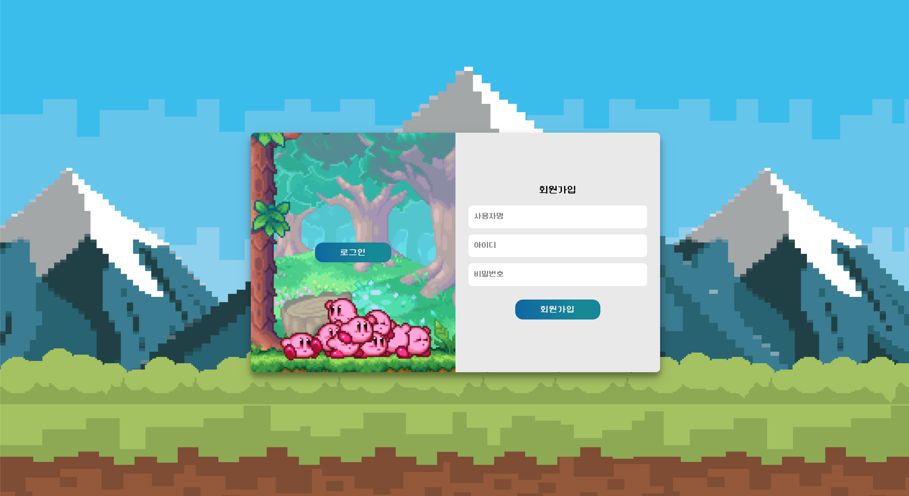
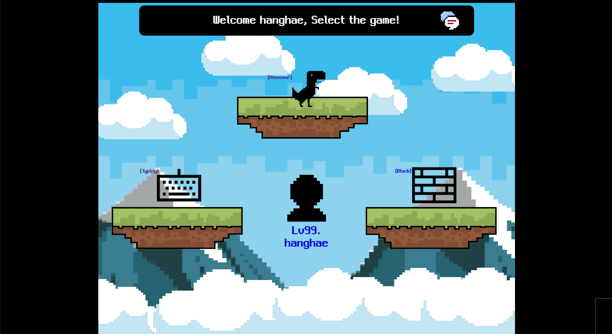
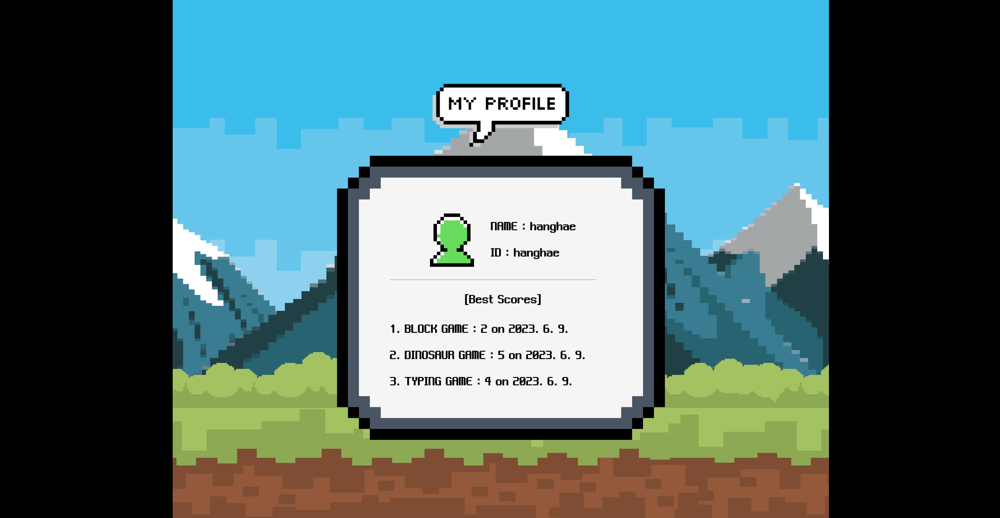

# 2023 Web Mini Project

# 🕹️ JS 미니게임모음 🕹️(부제: 내가 하려고 만든 게임)

 

### 🎮 Project nickname: 내가 하려고 만든 게임

### 🕚 Project execution period : 2023.06.02 ~ 2023.06.08

 

# 1. 💻 프로젝트 소개

## Youtube : https://www.youtube.com/watch?v=v2QXNQvxsG8

### 배포 : http://myweb.eba-ppjcz39z.ap-northeast-2.elasticbeanstalk.com/

 

 
미니 웹 프로젝트로 자바스크립트로 구현된 다양한 재미있는 미니게임이 모여있는 웹사이트이다. 이 프로젝트에는 옛날 픽셀 게임들을 활용해 구현된 세 가지의 미니게임으로 구성되어 있다. 이 웹사이트의 대부분의 그래픽과 폰트, 스타일에서 픽셀아트 느낌을 최대한 강조했다.

 

## 1-1. 흐름도

 

 
 
 

# 2. 👾 특징

1. 픽셀 아트와 레트로 디자인: 독특한 시각적 요소를 위해 flaticon에서 픽셀 아이콘을 주로 사용했다. 배경 사진 또한 무료 배경사진 사이트에서 픽셀아트 위주의 사진으로 적용했다. 또한 옛날 콘솔 게임 느낌의 오디오를 추가했다.

2. 간편하고 직관적인 인터페이스: 간단하고 직관적인 디자인으로 구성되어있고, 각각의 게임페이지는 싱글페이지로 한 페이지에서 게임 랭킹까지 볼 수 있다.

3. 스코어 기록 및 경쟁: 각각의 게임 페이지는 사용자의 게임 플레이 기록을 저장하고 표시한다. 또한 마이페이지에서 베스트 스코어를 비교할 수 있다.

 
 

# 3. ⚙️ 개발 언어

- JavaScript
- JQuery
- Python (Flask)
- Mongo DB
- CSS3
- HTML5

 

# 4. 📌 주요 기능

- 로그인 & 회원가입
- 마이프로필 조회 (최고 기록 확인)
- 세 종류의 미니게임 (블럭꺠기 게임, 타이핑 연습 게임, 공룡 장애물 게임)
- 게임 랭킹 시스템 (각 게임마다 구현))
- 반응형 웹 디자인 (데스크탑/태블릿)
   
   

# 5. 📸 간단 설명

- 회원가입 및 로그인 (영상 참고) : UI만 변경하여 싱글페이지로 두 기능 모두 구현
  
   
   

- 게임선택페이지 : 세 종류의 게임 및 메인페이지로 구성. 미디어 쿼리를 통한 반응형 웹 디자인
  
   
   

- 마이페이지 : 회원 게임 데이터를 가져와 각 게임별 최고점수 및 날짜를 보여주는 기능 구현
  

- 게임 페이지: 각 게임마다 최고기록부터 랭킹 및 날짜 보여주는 기능 구현

 
 
 

# 📚 레퍼런스 및 정보

- MDN | https://developer.mozilla.org/ko/docs/Games/Tutorials/2D_Breakout_game_pure_JavaScript
- YOUTUBE | https://www.youtube.com/watch?v=qkTtmgCjHhM
